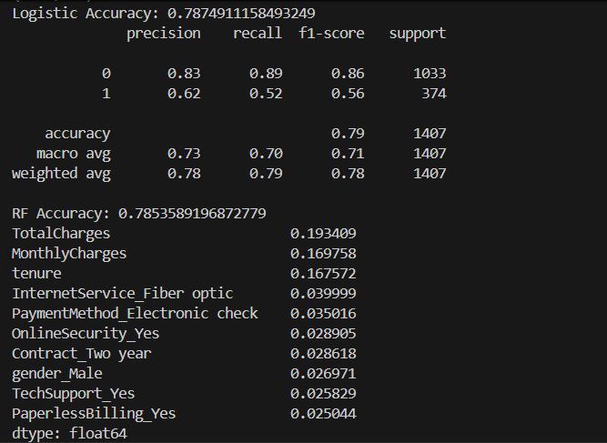
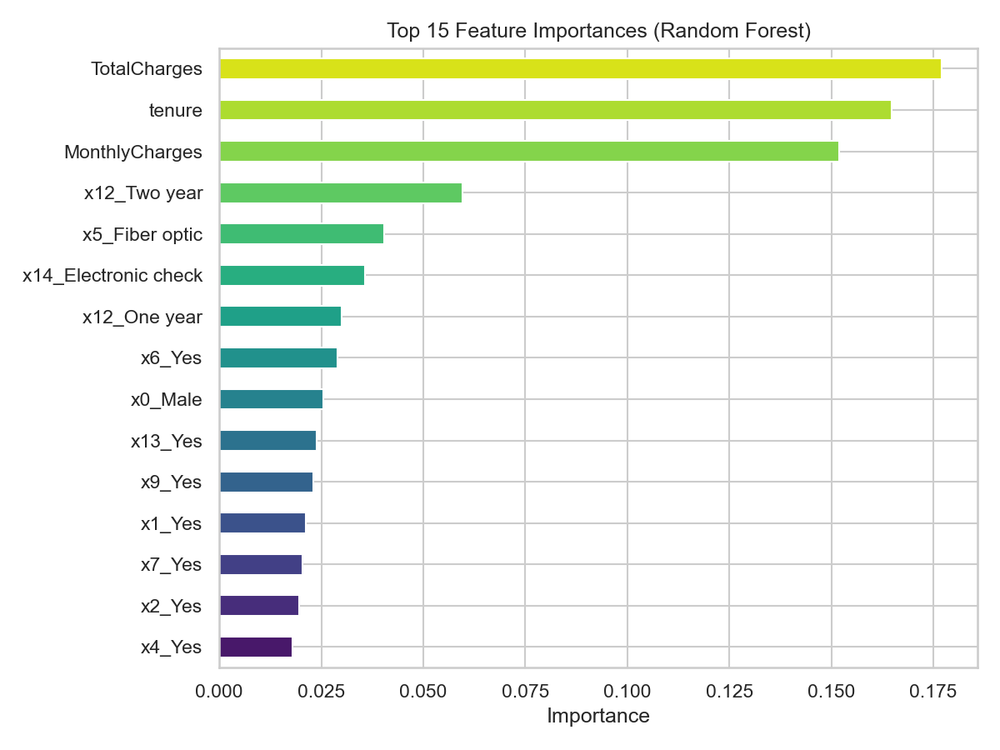

# Customer Churn Prediction

## 📌 Problem
Predict whether a customer will churn (leave) or not.

## 🛠 Tools Used
- Python
- Pandas
- Scikit-learn

## ⚙️ Process
- Data Cleaning
- Feature Encoding
- Model Training (Logistic Regression, Random Forest)

## 📊 Results

### 🔹 Model Performance

- Logistic Regression Accuracy: ~78%
- Random Forest Accuracy: ~78%

---

### 🔹 Feature Importance

## 🔍 Key Insights
- Customers with higher total and monthly charges are more likely to churn
- Longer tenure reduces churn probability
- Contract type significantly impacts customer retention