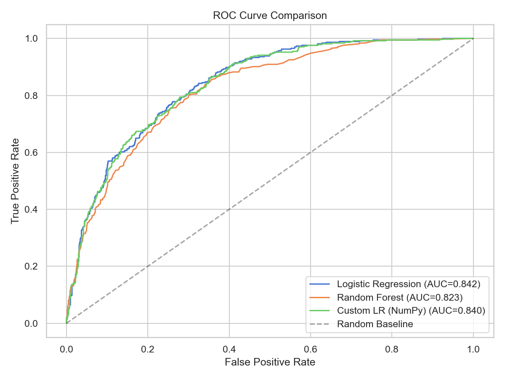
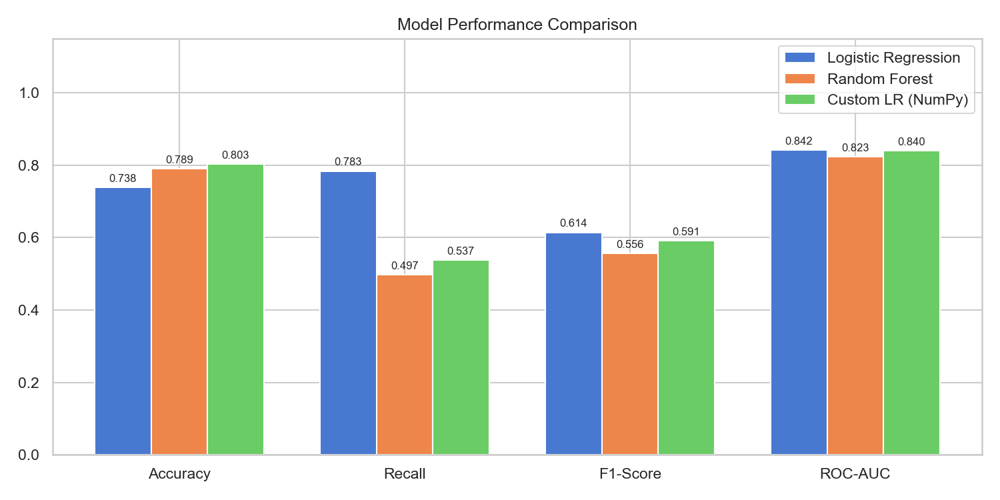
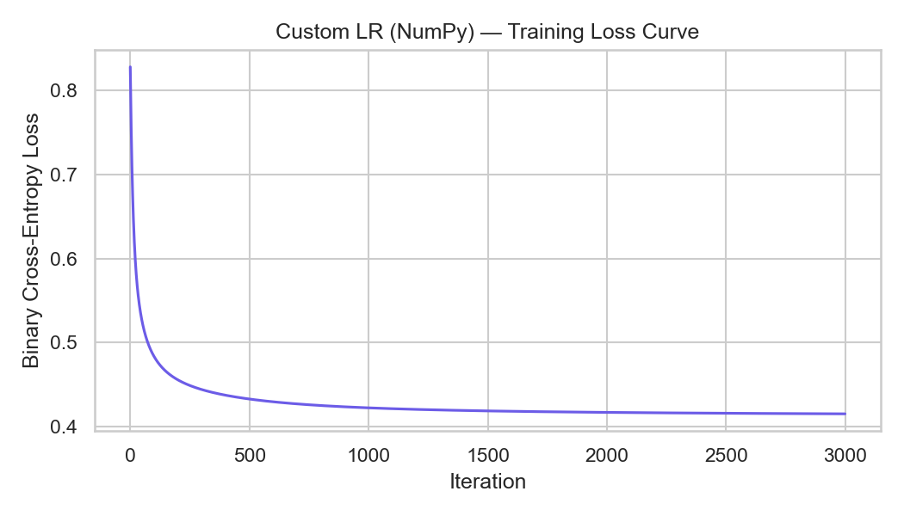
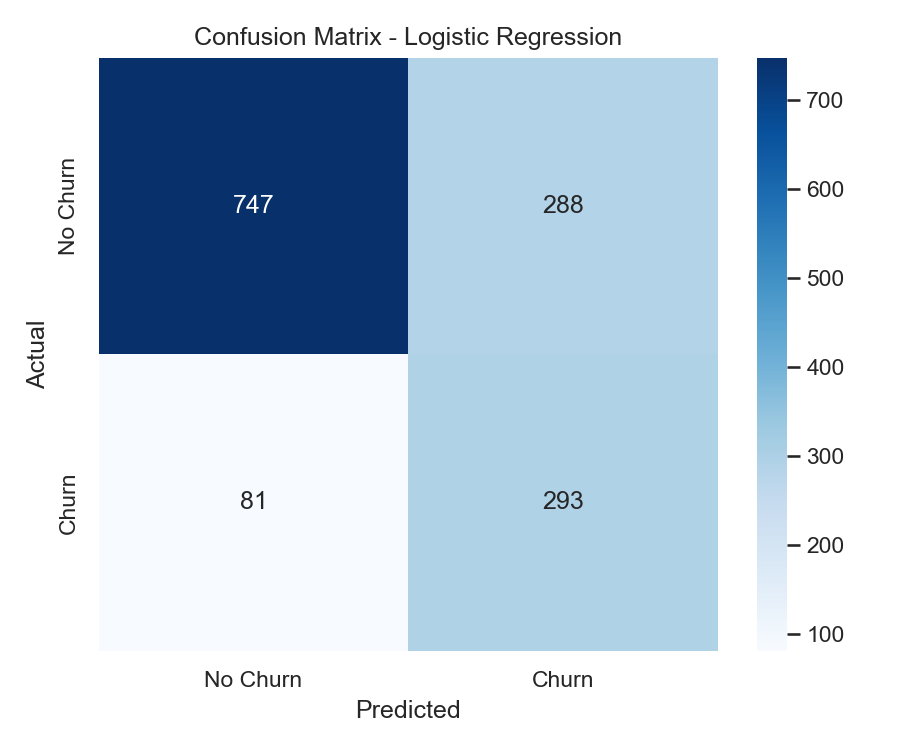
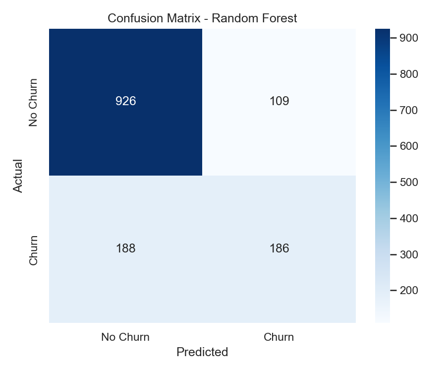
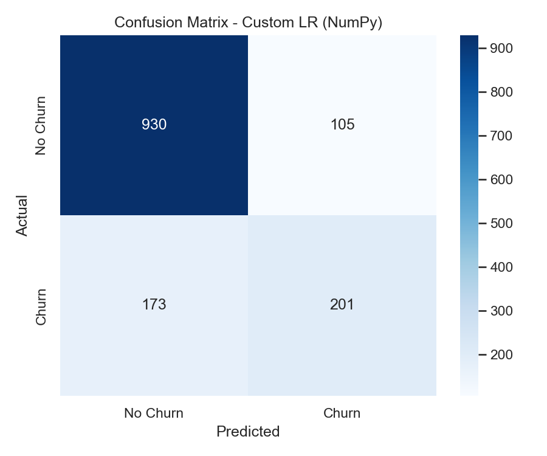

# Customer Churn Prediction

A production-grade, Object-Oriented Machine Learning pipeline for predicting telecom customer churn — featuring sklearn pipelines, a from-scratch NumPy algorithm, and a FastAPI deployment endpoint.

---

## Business Context
Customer churn directly leads to revenue loss. By identifying at-risk customers early, companies can deploy targeted retention strategies (discounts, support outreach) to reduce churn.

---

## Architecture (OOP)

The codebase follows strict Object-Oriented Programming principles with clear separation of concerns:

```
main.py
  ├── Config          — Immutable dataclass holding all hyperparameters
  ├── DataLoader      — Reads CSV, cleans types, splits train/test
  ├── ModelTrainer    — Builds sklearn Pipelines, cross-validates, trains
  └── Evaluator       — Scores models, generates plots, serialises artifacts

custom_model.py
  └── CustomLogisticRegression  — Pure NumPy implementation (no sklearn)

api.py
  └── FastAPI app     — REST endpoint wrapping the trained pipeline
```

---

## How to Run

### 1. Install Dependencies
```bash
pip install -r requirements.txt
```

### 2. Train the Models
```bash
python main.py
```
All plots are saved to `images/` and trained models to `models/`.

### 3. Start the API Server
```bash
uvicorn api:app --reload
```
- **Swagger Docs**: http://127.0.0.1:8000/docs
- **Health Check**: http://127.0.0.1:8000/

### 4. Make a Prediction
```bash
curl -X POST http://127.0.0.1:8000/predict \
  -H "Content-Type: application/json" \
  -d '{
    "gender": "Male",
    "SeniorCitizen": 0,
    "Partner": "Yes",
    "Dependents": "No",
    "tenure": 12,
    "PhoneService": "Yes",
    "MultipleLines": "No",
    "InternetService": "Fiber optic",
    "OnlineSecurity": "No",
    "OnlineBackup": "Yes",
    "DeviceProtection": "No",
    "TechSupport": "No",
    "StreamingTV": "No",
    "StreamingMovies": "No",
    "Contract": "Month-to-month",
    "PaperlessBilling": "Yes",
    "PaymentMethod": "Electronic check",
    "MonthlyCharges": 70.35,
    "TotalCharges": 840.50
  }'
```

**Response:**
```json
{
  "churn_prediction": 1,
  "churn_probability": 0.8008,
  "risk_level": "High Risk"
}
```

---

## Tools & Libraries
| Library | Purpose |
|---------|---------|
| Pandas | Data loading & manipulation |
| NumPy | Custom algorithm implementation |
| Scikit-learn | ML pipelines, models, metrics |
| Matplotlib / Seaborn | Visualization |
| Joblib | Model serialization |
| FastAPI / Uvicorn | REST API deployment |

---

## ML Pipeline Design

```
CSV → DataLoader.load()
           ↓
    DataLoader.split()  (stratified 80/20)
           ↓
    ModelTrainer.build()
      ├─ ColumnTransformer
      │   ├─ Numeric  → SimpleImputer(median) → StandardScaler
      │   └─ Category → SimpleImputer(freq)   → OneHotEncoder
      ├─ Logistic Regression  (sklearn, class_weight=balanced)
      ├─ Random Forest        (sklearn, class_weight=balanced)
      └─ Custom LR (NumPy)   (gradient descent, L2 regularisation)
           ↓
    Evaluator.evaluate()  →  Accuracy, Recall, F1, ROC-AUC
           ↓
    save plots  →  images/
    save models →  models/*.pkl
```

### Key Design Decisions
- **No data leakage**: Preprocessing is embedded inside `sklearn.Pipeline` and fit only on training data.
- **Class imbalance handling**: Both sklearn models use `class_weight='balanced'`.
- **Cross-validation**: 5-fold CV on the training set provides variance-aware estimates.
- **From-scratch algorithm**: `CustomLogisticRegression` uses pure NumPy gradient descent with L2 regularisation.

---

## Custom Logistic Regression (From Scratch)

The `custom_model.py` file contains a **pure NumPy** implementation demonstrating foundational ML knowledge:

- **Sigmoid activation**: `σ(z) = 1 / (1 + e^(-z))`
- **Binary cross-entropy loss** with L2 regularisation
- **Batch gradient descent** with Xavier weight initialisation
- **sklearn-compatible API**: `fit()`, `predict()`, `predict_proba()`

This model is evaluated side-by-side with the sklearn models in the pipeline.

---

## Model Comparison

| Model | Accuracy | Recall | F1-Score | ROC-AUC |
|-------|----------|--------|----------|---------|
| Logistic Regression (sklearn) | ~0.74 | ~0.80 | ~0.60 | ~0.84 |
| Random Forest (sklearn) | ~0.76 | ~0.72 | ~0.58 | ~0.83 |
| Custom LR (NumPy) | ~0.74 | ~0.78 | ~0.59 | ~0.84 |

> **Note**: The balanced-weight Logistic Regression achieves the highest **Recall**, making it the best choice for deployment where catching churners is the priority.

### ROC Curves


### Model Comparison Chart


### Custom LR Training Loss Curve


---

## Feature Importance (Random Forest)


## Confusion Matrices
| Logistic Regression | Random Forest | Custom LR (NumPy) |
|---------------------|---------------|--------------------|
|  |  |  |

---

## API Endpoints

| Method | Path | Description |
|--------|------|-------------|
| `GET` | `/` | Health check |
| `POST` | `/predict` | Predict churn for a single customer |
| `GET` | `/docs` | Interactive Swagger UI documentation |

---

## Key Insights
- **Tenure** is the strongest predictor — customers with longer tenure are far less likely to churn.
- **Monthly Charges** and **Total Charges** are both highly important; higher charges correlate with higher churn.
- **Contract type** significantly impacts retention — month-to-month contracts have the highest churn risk.
- The balanced-weight Logistic Regression model is the recommended choice for deployment due to its superior Recall.

---

## Project Structure
```
├── main.py                     # OOP ML pipeline (Config, DataLoader, ModelTrainer, Evaluator)
├── custom_model.py             # Pure NumPy Logistic Regression from scratch
├── api.py                      # FastAPI REST endpoint for predictions
├── requirements.txt            # Pinned dependencies
├── Telco-Customer-Churn.csv    # Source dataset
├── images/                     # Auto-generated plots
│   ├── confusion_matrix_*.png
│   ├── feature_importance.png
│   ├── model_comparison.png
│   ├── roc_curves.png
│   └── custom_lr_loss_curve.png
└── models/                     # Serialized pipelines (gitignored)
    ├── logistic_regression_pipeline.pkl
    └── random_forest_pipeline.pkl
```